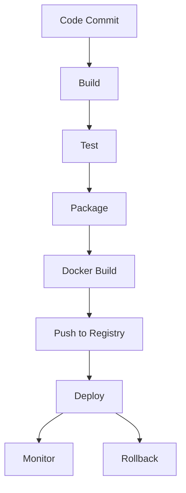

# CI/CD Pipeline Documentation

## Overview
The CI/CD pipeline automates build, test, packaging, Docker image creation, artifact storage, and deployment for the Task Management System using Jenkins.

## Pipeline Stages
1. **Build**: Compile code, run static analysis
2. **Test**: Run unit and integration tests, generate coverage reports
3. **Package**: Build JAR/WAR artifacts
4. **Docker Build**: Build Docker image, tag with commit/branch
5. **Push to Registry**: Push Docker image to JFrog Artifactory
6. **Deploy**: Deploy to target environment (dev, staging, prod) using Docker/Ansible
7. **Rollback**: Option to redeploy previous image/tag

## Triggers
- Push to `main` or `develop` branches
- Pull request events
- Manual trigger with parameters (for hotfixes, rollbacks)

## Artifact Storage
- JAR/WAR and Docker images stored in JFrog Artifactory
- Artifacts versioned by commit/tag

## Rollback
- Jenkins pipeline supports rollback to previous successful build/image
- Manual rollback possible via Jenkins UI or Docker image tag

## Pipeline Flow Diagram

## References
- [Jenkinsfile](../jenkins/Jenkinsfile)
- [Dockerfile](../docker/Dockerfile)
- [Ansible playbooks](../ansible/playbooks/) 